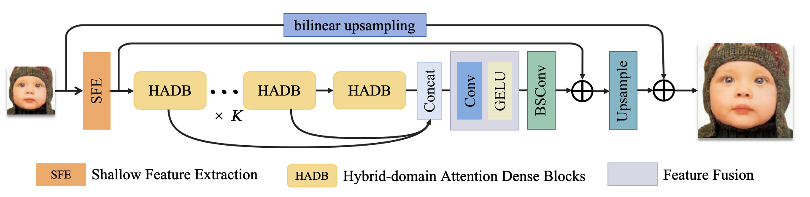

# HADN
Hybrid-Domain Attention Dense Network For Efficient Image Super-Resolution

## 🖥️ Environment

[PyTorch >= 1.9](https://pytorch.org/)  
[BasicSR >= 1.3.4.9](https://github.com/XPixelGroup/BasicSR)

### Installation
```
pip install -r requirements.txt
```
## 🧊 Data Prepare
The test datasets are available at [Google Drive](https://drive.google.com/drive/folders/1pRmhEmmY-tPF7uH8DuVthfHoApZWJ1QU) or [Baidu Netdisk](https://pan.baidu.com/s/1q_1ERCMqALH0xFwjLM0pTg#list/path=%2F)

## 🛠️ How To Test
· Refer to ./options/test for the configuration file of the model to be tested, and prepare the testing data or  and pretrained model.  
· We provide all pre-trained models, located in the folder ./pretrain_models. 
· Then run the follwing codes:  
```
python basicsr/test.py -opt options/test/benchmark_HADN_x4.yml
python basicsr/test.py -opt options/test/benchmark_HADN_x3.yml
python basicsr/test.py -opt options/test/benchmark_HADN_x2.yml
python basicsr/test.py -opt options/test/benchmark_HADN-S_x4.yml
```
The testing results will be saved in the ./results folder.


## 🍒 Resuilts

